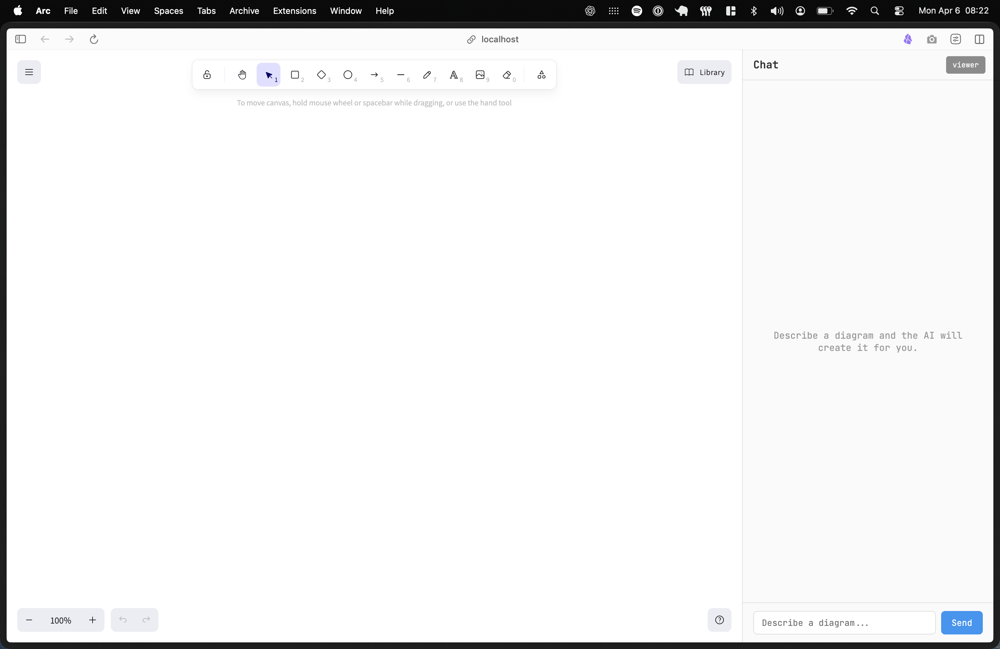

# EXCALI AGENT

A Cloudflare Workers agent that controls an Excalidraw canvas through tool calls.Measured  with evals, and systematically improved through (context engineering, better tools, RAG, generative UI, human-in-the-loop, planning, data flywheel).

## What the agent does
- Reads natural language requests ("draw a sequence diagram of an OAuth login")
- Controls an Excalidraw canvas via structured tool calls (add/update/remove elements)
- Reads the live canvas state on demand
- Searches the web for fresh information when it needs to
- Searches a private knowledge corpus via RAG when it needs precise reference material
- Streams responses, shows tool status, handles approvals, and gets better at all of this as you measure it

